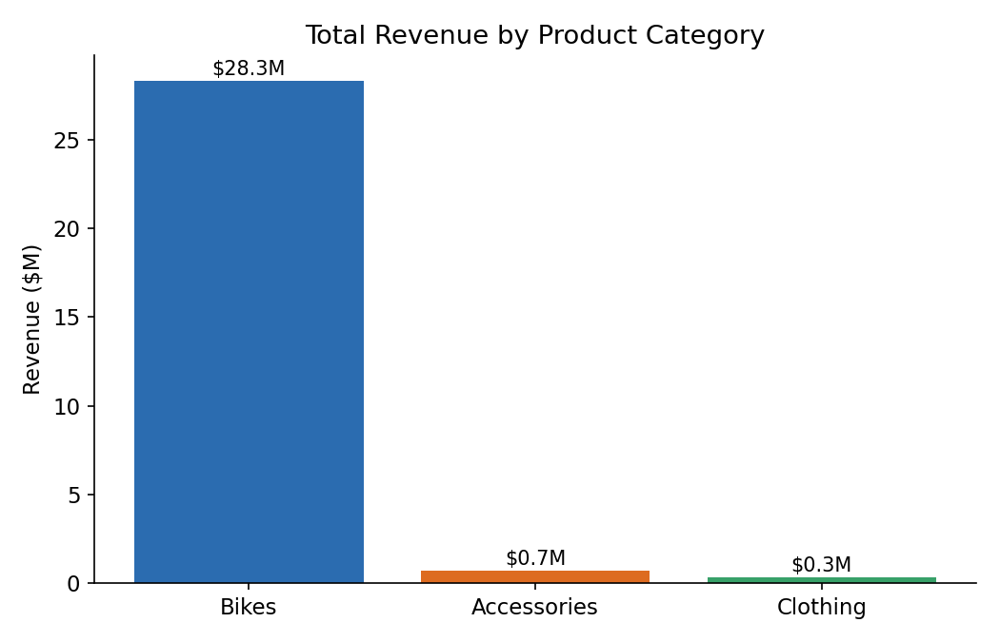
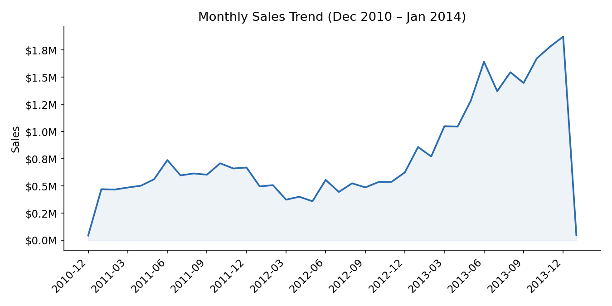
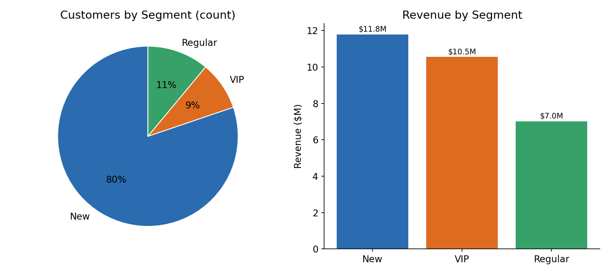
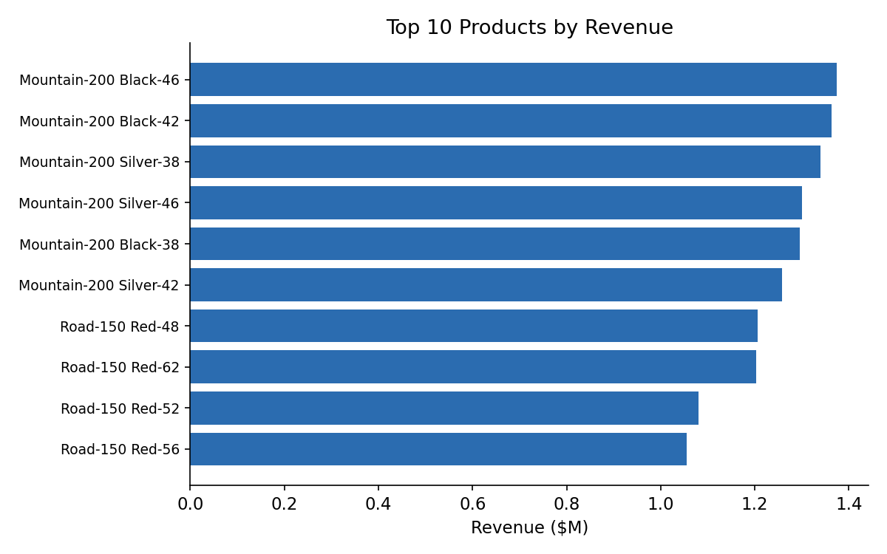
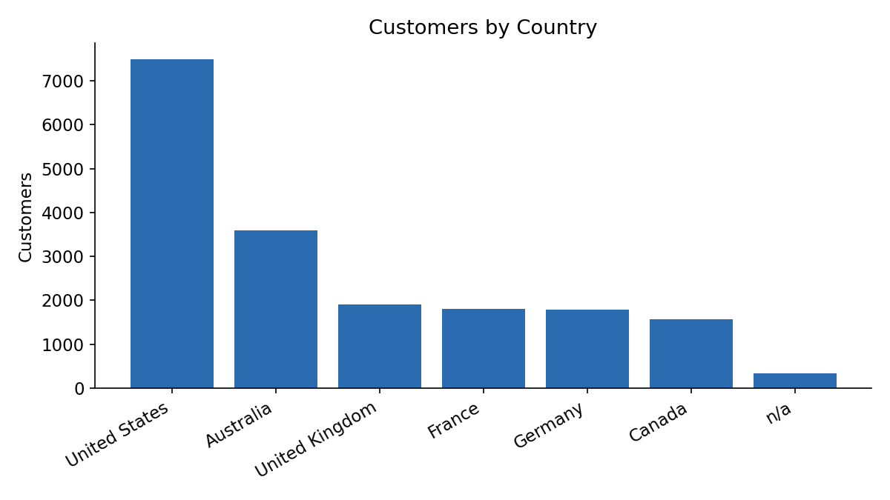

# Key Findings

Analysis of ~27,700 orders (60,423 units) placed by 18,484 customers between
**Dec 2010 and Jan 2014**, totaling **$29.36M** in revenue. All figures below
are pulled directly from the queries in `sql_data_analytics_project.sql`.

## 1. Revenue is almost entirely one category

**Bikes drive 96.5% of total revenue** ($28.3M), with Accessories (2.4%,
$0.7M) and Clothing (1.2%, $0.3M) a distant second and third. Any pricing,
inventory, or marketing decision should be evaluated primarily on its impact
to the Bikes line, since the other two categories move the needle very
little in absolute terms.

## 2. Sales trend is strongly upward, with a mid-2012 dip

Monthly revenue grew from ~$470K (early 2011) to a peak of ~$1.9M (Jan 2014),
but the path wasn't linear — there's a visible **soft patch in H1 2012**
before the strongest growth phase kicks in from late 2012 onward.

- **2012 vs. 2011: -17.4%** (full calendar years)
- **2013 vs. 2012: +179.8%**

Note: Dec 2010 and Jan 2014 are partial months (single-month slivers at each
edge of the dataset), so they should be excluded from any year-over-year
comparison — they are not real seasonal drops.

## 3. A small VIP segment drives disproportionate revenue

Using the segmentation in `10_data_segmentation.sql` (12+ months of history
and >$5,000 spent = VIP):

| Segment | Customers | % of customers | Revenue | % of revenue |
|---|---|---|---|---|
| VIP | 1,617 | 8.7% | $10.5M | 35.9% |
| Regular | 2,039 | 11.0% | $7.0M | 23.9% |
| New | 14,826 | 80.2% | $11.8M | 40.2% |

**The 8.7% of customers classified VIP generate 35.9% of all revenue** —
roughly 4x their proportional share. This is the clearest 80/20-style signal
in the dataset and the strongest case for a retention or loyalty-focused
follow-up analysis.

## 4. Revenue concentrates in a narrow product line

The top 10 products by revenue are all Mountain-200 and Road-150 bike
variants (different colors/sizes of the same two models), each generating
$1.0M–$1.4M individually. Out of 295 products in the catalog, only 130 were
ever sold, and revenue within "Bikes" itself concentrates heavily in these
two model lines.

## 5. Customer base is US/Australia-heavy with a long tail

Of 18,484 customers, **United States (7,482) and Australia (3,591) alone
account for 60%** of the customer base. The remaining customers are spread
across UK, France, Germany, and Canada in a fairly even long tail
(1,570–1,910 each).

---

### Caveats
- Segment thresholds (VIP/Regular/New, High/Mid/Low-Performer) are the
  illustrative rules defined in the scripts, not externally validated
  business definitions — a real stakeholder conversation would set these.
- 337 customers (1.8%) have no country recorded (`n/a`) and are excluded from
  the country breakdown chart's ranking but included in customer counts.
